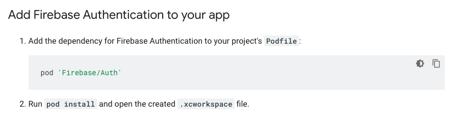
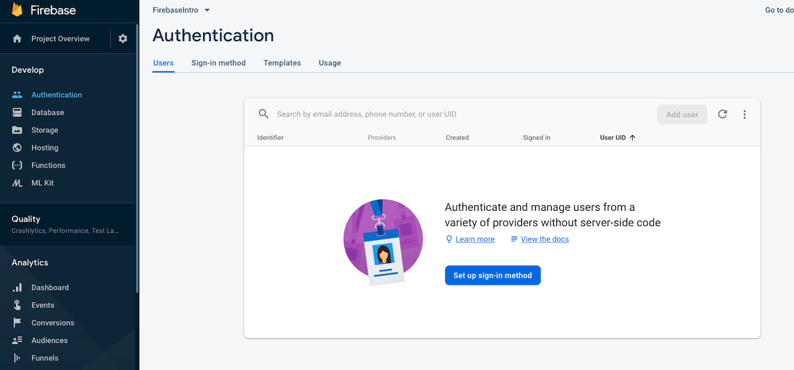
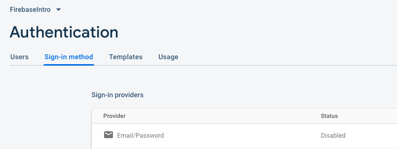
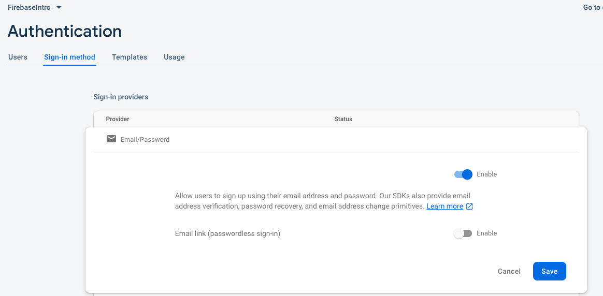
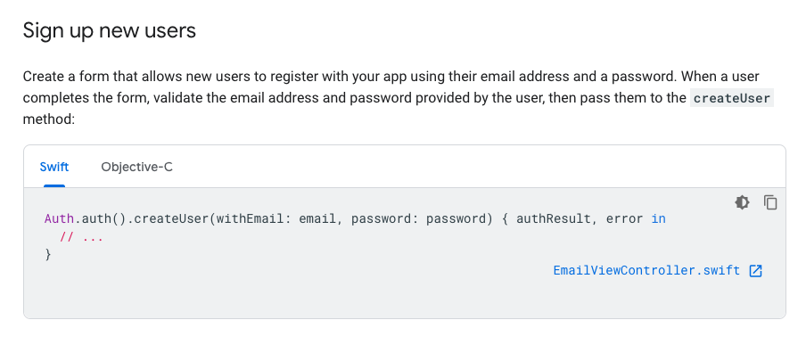
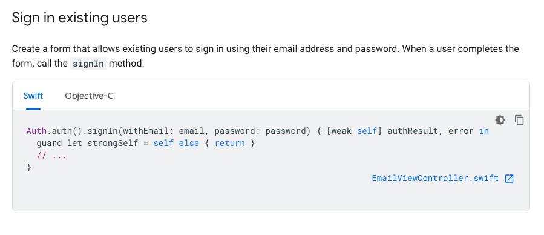
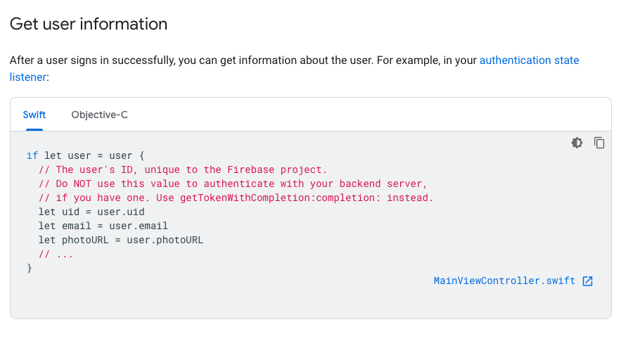
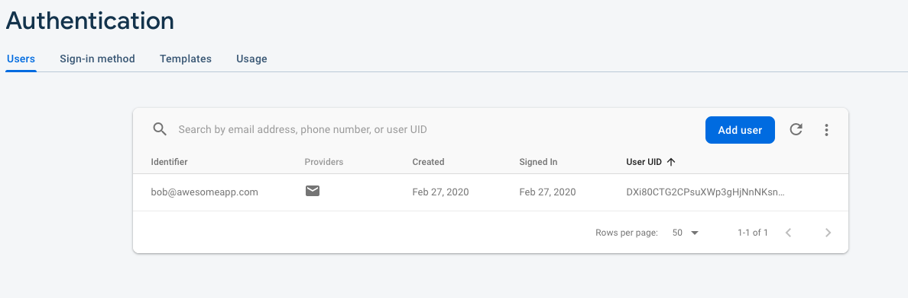
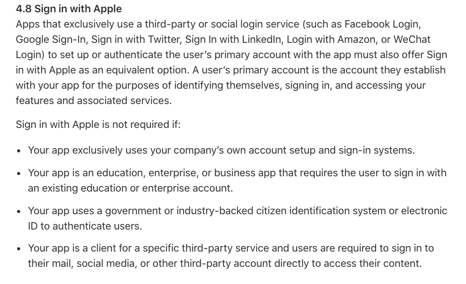

# Firebase Authentication 

## 1. Add Firebase Auth to your Podfile 

```pod Firebase/Auth```



## 2. Set up sign-in method in the Firebase console 







## 3. Sign up new users 



## 4. Sign in existing users 



## 5. Get user information 



## 6. Views Users in the Firebase console 



## 7. Sign in with Apple requirement (if you are providing sign in methods e.g Facebook, Google...)



More on sign in with Apple from the [AppStore review guidelines](https://developer.apple.com/app-store/review/guidelines/#sign-in-with-apple). 


