# Firebase - Getting Started

Introduction to Firebase. In this app we will cover Authentication, Database and Storage.

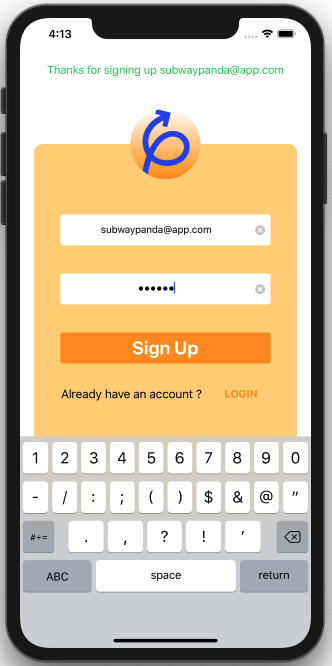

[Firebase](https://firebase.google.com/) 

## 1. Sign up using your Google account and create a Firebase Project

[Firebase Console](https://console.firebase.google.com/u/0/)

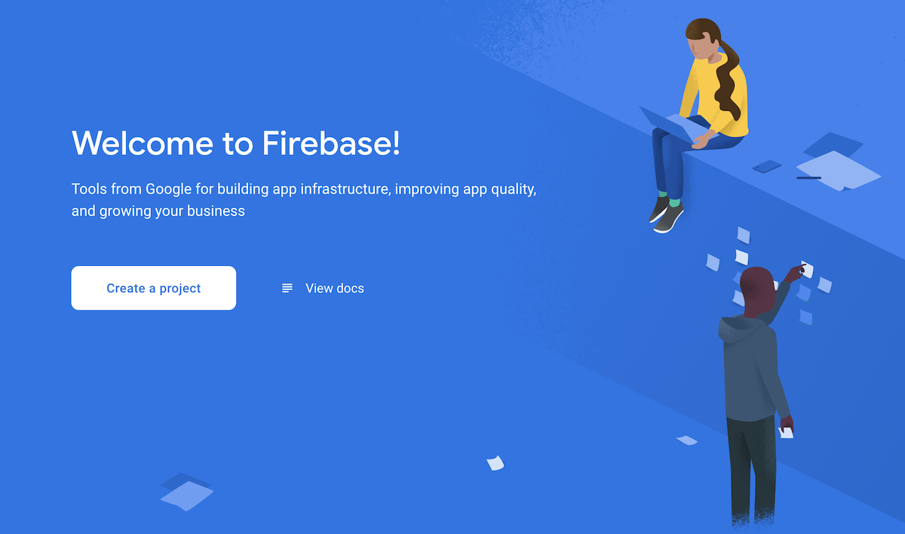

## 2. Part 1 of 3 of creating a Firebase project 

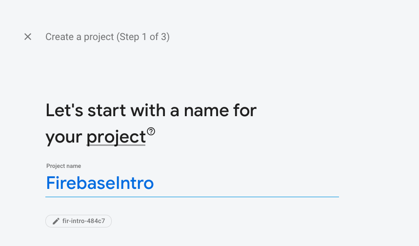


## 3. Part 2 of 3 of creating a Firebase project 

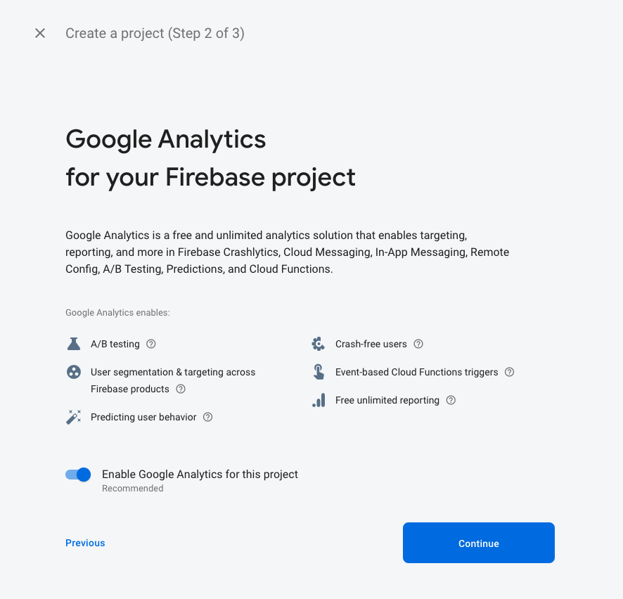


## 4. Part 3 of 3 of creating a Firebase project 

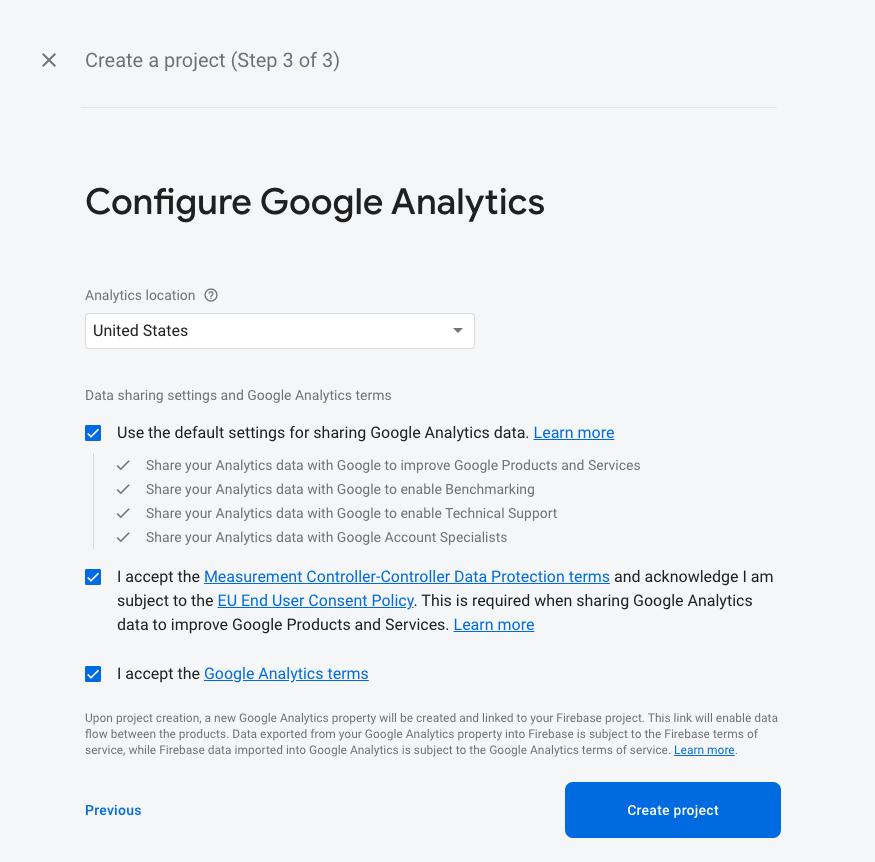


## 5. Project created 


## 6. Firebase console 

In the left column are the services available from Firebase. In this course we will be using **Authentication**, **Database** and **Storage**. 

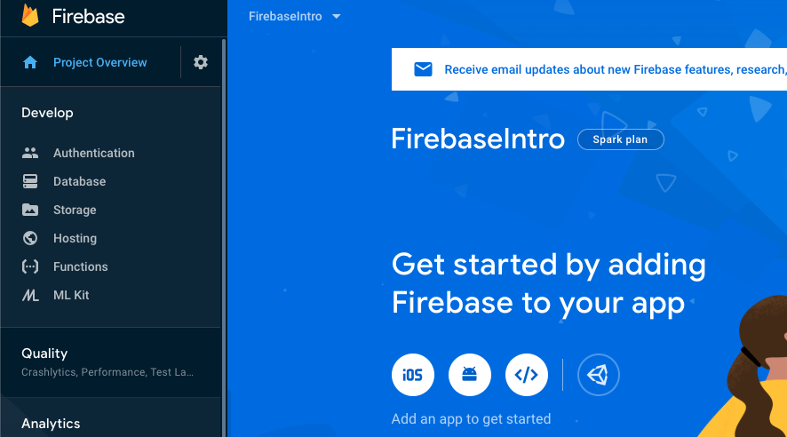

## 7. Let's now add the Firebase project to our iOS app

Click on the iOS button to start the process integrating the Firebase project with your Xcode project. This will be make possible with a created GoogleService-Info.plist file. 

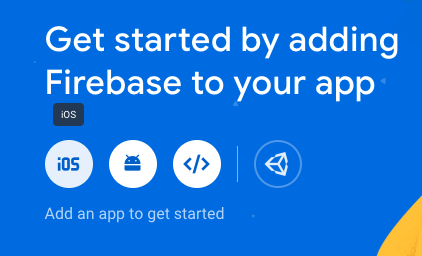

## 8. Add the bundle identifier from Xcode to your Firebase project 

The bundle identifier is critical in associating your Xcode project with the Firebase project.

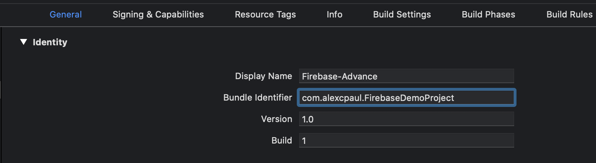


## 9. If your Github repository is public add your GoogleService-Info.plist to .gitignore

**.gitignore** file 

GoogleService-Info.plist 

## 10. Download the GoogleService-Info.plist file 

Download the GoogleService-Info.plist file and add it to your Xcode project. 

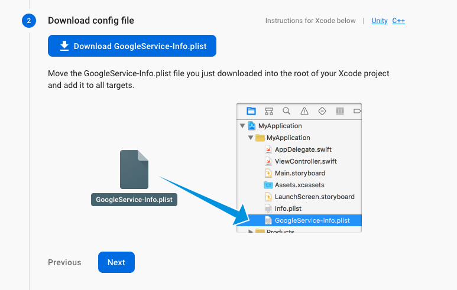

## 11. Add the Firebase SDK using CocoaPods to your project 

Initialize pod into your project by running ```pod init``` in Terminal. Open your Podfile and add ```pod 'Firebase/Analytics'``` to it and run ```pod install```. At this point closse Xcode and now you will have an **xcworkspace** you will be editing from now on. This xcworkspace will have your Xcode project along with the Pods that were installed.

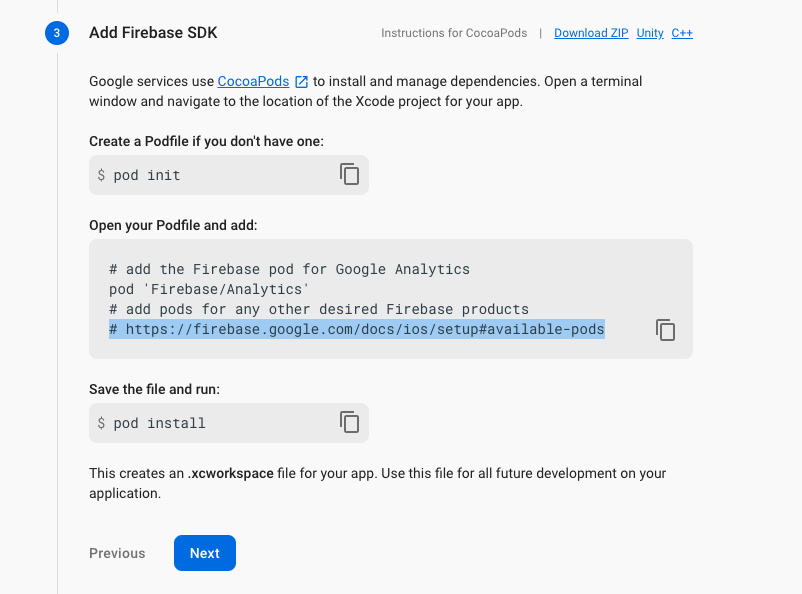

## 12. Dependencies for Firebase installed 

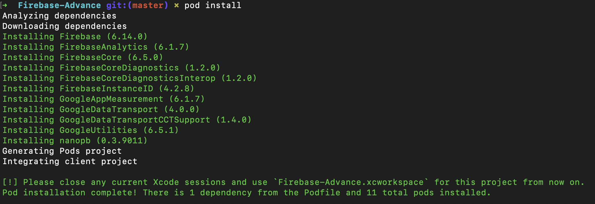

## 13. Initialize Firebase into your Xcode project

Open your xcworkspace and Edit the AppDelegate as pictured below: 

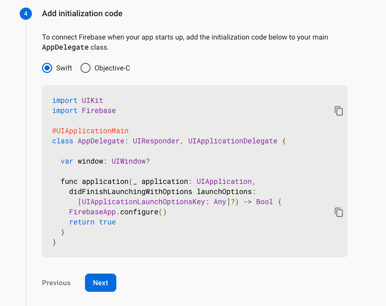

## 14. App is verified from Firebase servers as being now connected

To verify all went well with the Firebase integration, delete the app and re-run it after adding Firebase configuration in the AppDelegate, wait a few moments for the Firebase server to detect the connection. If all went well you will receieve the verification banner below. Congratulations. 🥳

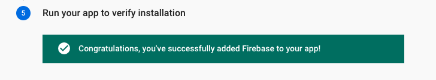


## Resources 

1. [Firebase iOS Documentation](https://firebase.google.com/docs/ios/setup)
2. [Firebase](https://firebase.google.com/) 
3. [Firebase Console](https://console.firebase.google.com/u/0/)
4. [Firebase Authentication](https://firebase.google.com/docs/auth)
5. [Firebase Firestore](https://firebase.google.com/docs/firestore)
6. [Firebase Storage](https://firebase.google.com/docs/storage)
7. [What is Firebase?](https://howtofirebase.com/what-is-firebase-fcb8614ba442)


